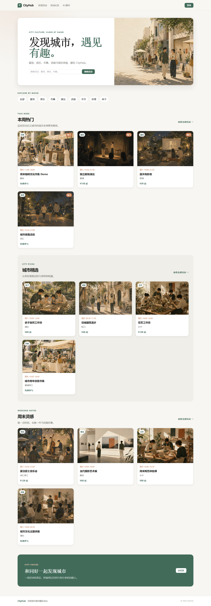
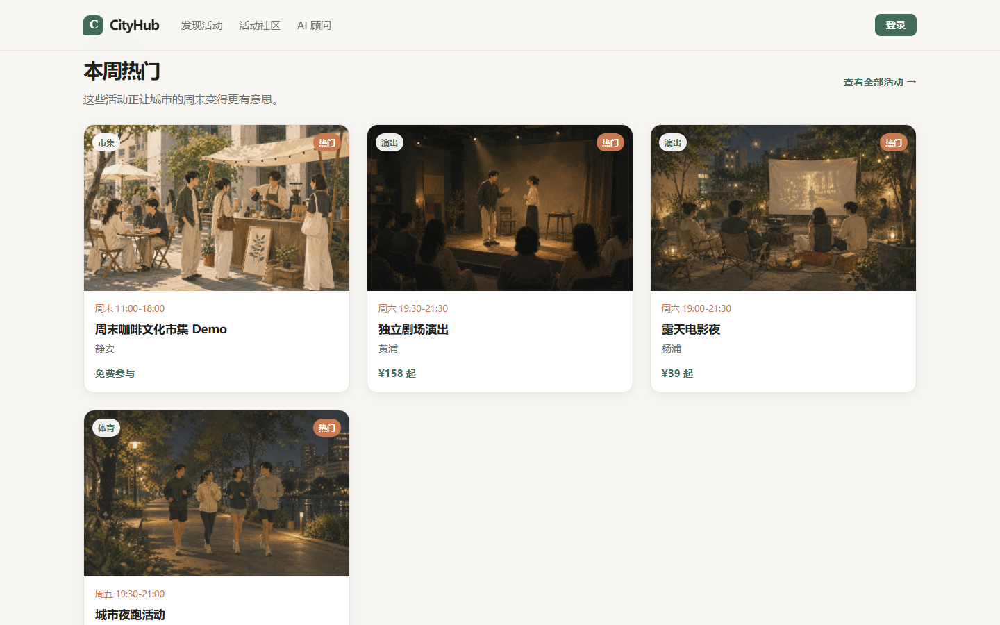
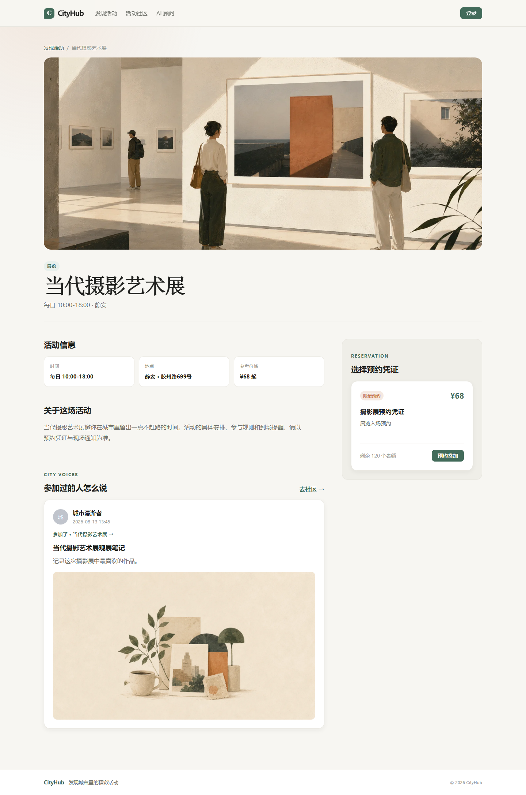
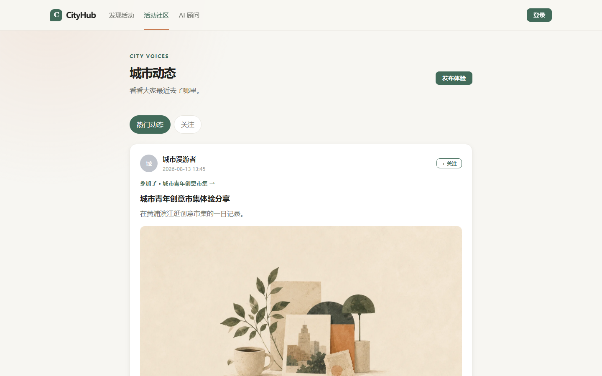
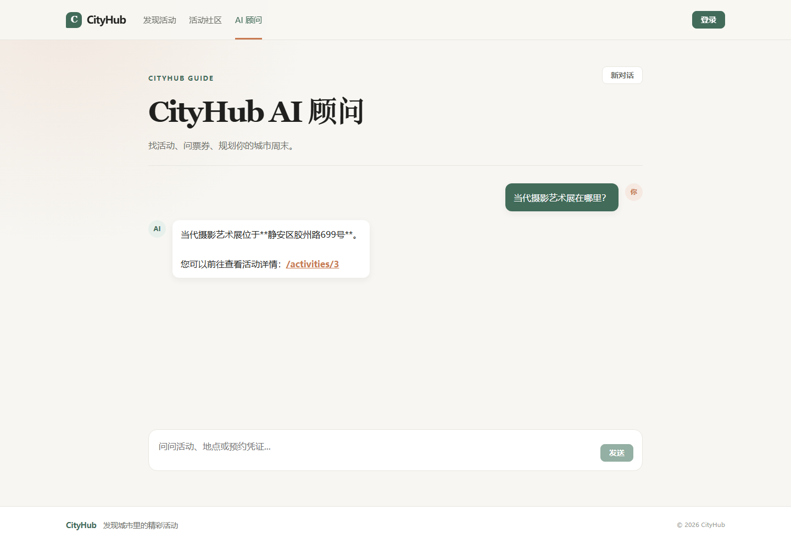
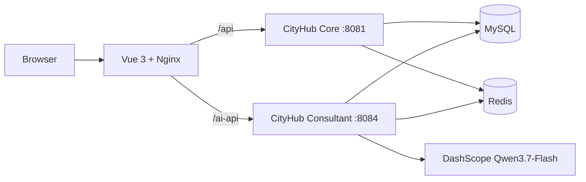

# CityHub · 城市活动发现与预约平台

CityHub 面向城市文化活动，提供活动发现、限量预约、社区互动与 AI 活动顾问。项目采用前后端分离架构：浏览器通过 Nginx 访问 Vue Web，并分别代理 Core API 与 AI Streaming API。

## GitHub Showcase

以下截图均来自 Docker/Nginx 真实页面 `http://127.0.0.1:8088`，统一使用横屏宽图，按用户旅程纵向展示。

### 首页 / 本周热门

用一张暖白与深墨的首页把城市文化活动、分类入口和周末灵感放在同一条发现路径上。



本周热门把真实活动卡片、时间、地点和预约价格集中呈现，帮助用户快速决定下一站。



### 活动详情 / 预约

详情页把真实活动信息、地点、价格、活动动态预览和限量预约凭证集中呈现。



### 社区互动

社区动态关联真实 Activity，用户可以浏览活动体验、点赞并继续探索对应活动。



### AI 活动顾问

AI 顾问使用真实 Qwen `qwen3.7-flash` 与 ActivityTool 查询活动，并将预约引导回现有详情页流程。



## 已实现功能

- 活动分类、分页、搜索、详情与票券查询。
- 限量预约：Redis Lua 原子校验库存和一人一单，Redis 预扣库存，单 JVM `BlockingQueue` 异步落库，Redisson 用户锁，MySQL 唯一约束兜底。
- 活动社区：关联活动的 Blog、Redis ZSet 点赞排行、Follow 与 Feed 推送/滚动分页。
- AI 顾问：Qwen `qwen3.7-flash`、LangChain4j Tool Calling、Redis Chat Memory、流式输出；只能查询活动并引导到 `/activities/:id`，不会直接创建预约。
- 活动缓存：空值缓存、逻辑过期异步重建、互斥锁、随机 TTL 与更新后删缓存。

## 架构



## 技术栈

- Core：Spring Boot 2.7、MyBatis-Plus、MySQL、Redis、Redisson、Lua
- AI：Spring Boot 3.5、LangChain4j、DashScope OpenAI-compatible API、Qwen3.7-Flash、Redis Chat Memory
- Web：Vue 3、Vite、Vue Router、Pinia、Axios、Element Plus
- 部署：Docker Compose、Nginx

## Docker 快速启动

1. 复制 `.env.example` 为 `.env`，填入本地 MySQL 密码和 `ALIYUNCS_API_KEY`；`.env` 已被 Git 忽略。
2. 先在宿主机生成后端可执行 jar：

```powershell
mvn -f backend/pom.xml -pl core -am package -DskipTests
mvn -f backend/consultant/pom.xml package -DskipTests
```

3. 在仓库根目录执行：

```powershell
docker compose up -d --build
```

4. 打开 `http://localhost:8088`。

Compose 会启动 `cityhub-mysql`、`cityhub-redis`、`cityhub-core`、`cityhub-consultant` 与 `cityhub-web`。MySQL 和 Redis 均使用命名 volume 持久化；正常停止使用 `docker compose down`，不会删除数据卷。

## 环境变量

| 变量 | 用途 | 是否必填 |
| --- | --- | --- |
| `MYSQL_DATABASE` / `MYSQL_USER` / `MYSQL_PASSWORD` / `MYSQL_ROOT_PASSWORD` | Compose 初始化 MySQL | Docker 是 |
| `DB_URL` / `DB_USERNAME` / `DB_PASSWORD` | Core、Consultant 数据库连接 | 是 |
| `REDIS_HOST` / `REDIS_PORT` / `REDIS_PASSWORD` | Redis 连接 | 是（密码可空） |
| `ALIYUNCS_API_KEY` | DashScope API Key | AI 是 |
| `LLM_BASE_URL` | OpenAI-compatible Base URL | 是 |
| `LLM_MODEL_NAME` | Qwen 模型名，默认 `qwen3.7-flash` | 是 |

## 本地开发

Core 默认端口为 `8081`，Consultant 为 `8084`，Vite 为 `5173`。先准备 MySQL、Redis 与根目录 `.env`，再分别执行：

```powershell
cd backend/core
./run-local.ps1

cd ../consultant
./run-local.ps1

cd ../../web
npm run dev
```

`web` 的开发代理与 Nginx 保持相同规则：`/api` 转发 Core，`/ai-api` 转发 Consultant；请求头使用 `authorization: <token>`。

Docker 镜像使用上一步生成的 jar，避免将构建时的 Maven 网络可用性变成运行时依赖；Web 仍在镜像构建时执行 `npm ci` 与 `npm run build`。

## 工程取舍

- 限量预约当前是单 JVM `BlockingQueue` 方案，未引入 Kafka、RabbitMQ 或 Redis Stream，适合当前单实例展示场景。
- AI 只承担活动发现、查询和预约引导；预约仍由现有 Core 流程处理。
- Docker 下 Core 为兼容现有 MyBatis-Plus 版本，在 Compose 中设置了 Java 17 模块开放参数。
