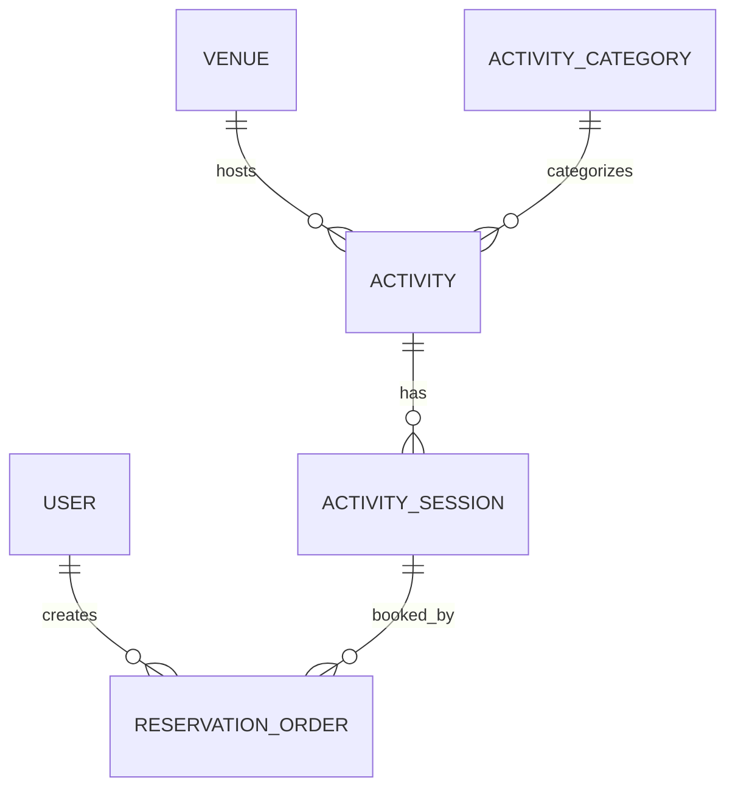

# Codex 执行任务：Phase 3A CityHub 核心领域模型与数据库骨架

## 一、任务背景

当前项目已经完成：

- Phase 1：基础工程基线治理；
- Phase 2：项目身份规范化。

当前工程身份已经统一为：

> **CityHub - 城市活动发现与预约平台**

Maven、Java package、Application、Spring application name 等工程身份已经完成迁移，当前 `backend` 下可以正常执行：

```bash
mvn clean compile
```

Phase 2 刻意保留了旧业务：

```text
Shop
ShopType
Voucher
SeckillVoucher
VoucherOrder
Blog
BlogComments
Follow
```

以及：

```text
/shop
/voucher
/blog
tb_*
Redis 业务 Key
Lua 秒杀
AI Tool 业务
```

这是有意为之。

从 Phase 3 开始，正式建立真正属于 CityHub 的业务领域。

---

# 二、Phase 3 总体业务方向

CityHub 的核心业务不是“商铺 + 优惠券”。

新的核心主线为：

```text
场馆
Venue
  │
  ▼
活动
Activity
  │
  ▼
活动场次
ActivitySession
  │
  ▼
预约订单
ReservationOrder
```

并结合：

```text
User
ActivityCategory
```

形成：

```text
User
 │
 └──────────── ReservationOrder
                     │
                     ▼
              ActivitySession
                     │
                     ▼
                  Activity
                 /        \
                ▼          ▼
             Venue   ActivityCategory
```

---

# 三、本阶段的核心目标

Phase 3A 只完成：

> **新领域模型 + Mapper + 数据库 DDL + 领域设计文档**

本阶段必须建立以下核心领域：

```text
Venue
ActivityCategory
Activity
ActivitySession
ReservationOrder
```

已有：

```text
User
```

继续复用。

---

# 四、本阶段不做业务闭环

本阶段禁止实现：

```text
活动 Controller
活动查询 Service
预约 Service
创建预约
取消预约
库存扣减
Redis 预约
Lua
MQ
缓存
Feed
AI Tool
```

这些后续分别属于：

```text
Phase 3B：活动查询
Phase 3C：MySQL 基线预约
Phase 4：Redis 高并发预约
Phase 5：社区业务
Phase 6：AI
```

Phase 3A 的重点是：

> **先把领域关系和数据库设计做正确。**

---

# 五、非常重要：不是 Rename 旧模型

严禁进行：

```text
Shop.java -> Venue.java
ShopType.java -> ActivityCategory.java
Voucher.java -> Activity.java
VoucherOrder.java -> ReservationOrder.java
```

也不要从旧类复制后只改名字。

正确做法：

```text
创建全新的 Venue
创建全新的 ActivityCategory
创建全新的 Activity
创建全新的 ActivitySession
创建全新的 ReservationOrder
```

旧模型继续保留。

等新业务链路跑通后，再逐步废弃旧模型。

---

# 六、执行前必须先阅读当前真实代码

在编码前，请完整检查：

```text
backend/pom.xml
backend/core/pom.xml

backend/core/src/main/java/com/cityhub/
backend/core/src/main/resources/

现有：
entity / domain / model
mapper
service
controller
utils
config

当前 User 实体
当前 User 对应数据库表
当前 BaseEntity / 公共字段设计（如果存在）
当前 MyBatis-Plus 使用方式
当前 @TableName / @TableId 习惯
当前 create_time / update_time 处理方式

backend/core/src/main/resources/db/
```

必须确认：

1. 当前 User 主键的数据类型；
2. 当前实体是否使用 Lombok；
3. 当前是否统一使用 MyBatis-Plus；
4. Mapper 的 package；
5. `@MapperScan` 范围；
6. 是否存在公共 BaseEntity；
7. 主键使用 AUTO / ASSIGN_ID / INPUT 哪一种；
8. MySQL 实际版本或项目所面向的大致版本；
9. 是否已有自动填充 create_time / update_time；
10. 是否有全局逻辑删除；
11. 是否使用数据库外键。

---

# 七、设计原则

## 原则 1：Venue 与 Activity 必须分离

例如：

```text
Venue
上海当代艺术馆

Activity
城市影像艺术展
```

一个 Venue 可以举办多个 Activity。

关系：

```text
Venue 1 : N Activity
```

---

## 原则 2：Activity 与 ActivitySession 必须分离

例如：

```text
Activity
城市影像艺术展

ActivitySession
2026-08-20 10:00 - 12:00

ActivitySession
2026-08-20 14:00 - 16:00
```

关系：

```text
Activity 1 : N ActivitySession
```

---

## 原则 3：名额属于 ActivitySession

严禁：

```text
Activity.stock
Activity.remainingQuota
```

必须：

```text
ActivitySession.capacity
ActivitySession.remainingQuota
```

因为不同场次有独立容量。

这是 CityHub 新领域与旧 Voucher 秒杀模型最关键的结构差异之一。

---

## 原则 4：用户预约具体场次

用户预约：

```text
ActivitySession
```

而不是直接预约：

```text
Activity
```

所以：

```text
ReservationOrder.sessionId
```

是核心关联字段。

---

## 原则 5：一人一场次只能有一个有效预约入口

数据库必须设计：

```text
UNIQUE(user_id, session_id)
```

作为最终数据约束。

Redis / Lua 后续只负责高性能资格判断。

MySQL Unique Index 负责最终兜底。

---

## 原则 6：当前项目先做免费/名额预约

本阶段不要引入：

```text
price
payment
refund
coupon
VIP
points
```

不要把 CityHub 做成票务电商系统。

---

# 八、领域 1：Venue

## 含义

物理活动场馆。

例如：

```text
上海当代艺术馆
798 艺术中心
某市文化中心
Blue Note
```

---

## 建议字段

至少包括：

```text
id
name
description

city
district
address

longitude
latitude

coverUrl
phone

status

createTime
updateTime
```

---

## 数据库建议

建议表：

```text
venue
```

建议类型：

```text
id             BIGINT
name           VARCHAR(128)
description    TEXT
city           VARCHAR(64)
district       VARCHAR(64)
address        VARCHAR(255)
longitude      DECIMAL(10,7)
latitude       DECIMAL(10,7)
cover_url      VARCHAR(512)
phone          VARCHAR(32)
status         TINYINT
create_time    DATETIME
update_time    DATETIME
```

字段长度可基于当前项目编码习惯适度调整，但不要无理由扩大。

---

## 索引建议

至少考虑：

```text
(city, status)
```

或根据实际查询预期设计等价索引。

暂时不要引入 Redis GEO。

GEO 属于后续业务阶段。

---

# 九、领域 2：ActivityCategory

## 含义

活动分类。

例如：

```text
展览
音乐
市集
演出
讲座
手作
体育
亲子
```

---

## 建议字段

```text
id
name
icon
sort
status
createTime
updateTime
```

---

## 表

```text
activity_category
```

---

## 约束

分类名称建议具有合理唯一性，例如：

```text
UNIQUE(name)
```

如果结合实际代码发现不适合，请在报告中解释。

---

# 十、领域 3：Activity

## 含义

活动内容主体。

例如：

```text
2026 城市影像艺术展
夏季爵士音乐会
周末陶艺体验课
城市青年创意市集
```

---

## 建议字段

```text
id

venueId
categoryId

title
subtitle
description
coverUrl

organizer

status
publishTime

createTime
updateTime
```

---

## 表

```text
activity
```

---

## 重要约束

Activity 中：

```text
不要有 stock
不要有 remainingQuota
```

库存全部属于 ActivitySession。

---

## 关系

```text
venue_id
->
Venue.id
```

```text
category_id
->
ActivityCategory.id
```

---

## 索引

至少考虑：

```text
(venue_id, status)
(category_id, status)
(status, publish_time)
```

根据实际 MySQL 设计调整。

---

# 十一、领域 4：ActivitySession

这是本项目最关键的业务实体之一。

---

## 含义

活动的具体可预约场次。

---

## 建议字段

```text
id
activityId

startTime
endTime

bookingStartTime
bookingEndTime

capacity
remainingQuota

status
version

createTime
updateTime
```

---

## 表

```text
activity_session
```

---

## 字段含义

### capacity

总名额。

例如：

```text
100
```

---

### remainingQuota

当前剩余名额。

初始：

```text
remainingQuota = capacity
```

后续预约成功：

```text
remainingQuota - 1
```

取消：

```text
remainingQuota + 1
```

具体业务将在 Phase 3C 实现。

---

### bookingStartTime

开放预约时间。

---

### bookingEndTime

停止预约时间。

---

### version

为后续 MySQL 乐观并发控制预留。

本阶段只建立字段。

不要实现复杂乐观锁业务。

---

## 数据约束

必须在设计文档中明确：

```text
capacity >= 0

0 <= remainingQuota <= capacity

startTime < endTime

bookingStartTime < bookingEndTime

bookingEndTime <= startTime
```

是否使用数据库 CHECK 约束：

必须根据项目所使用 MySQL 版本和当前数据库规范决定。

不要为了“高级”强制使用 CHECK。

即使没有数据库 CHECK，也要在文档中写清业务不变量。

---

## 索引

至少考虑：

```text
(activity_id, start_time)
(status, booking_start_time, booking_end_time)
```

根据实际查询模式优化。

---

# 十二、领域 5：ReservationOrder

这是预约业务的数据核心。

用于取代未来核心业务中的：

```text
VoucherOrder
```

但本阶段必须全新创建，不做 Rename。

---

## 建议字段

```text
id

reservationNo

userId
activityId
sessionId

status

reservedAt
cancelledAt
completedAt

createTime
updateTime
```

---

## 表

```text
reservation_order
```

---

## 为什么保留 activityId

理论上：

```text
sessionId
->
ActivitySession
->
activityId
```

能够查询 Activity。

但是 ReservationOrder 属于高频订单查询数据。

可以冗余：

```text
activity_id
```

便于：

```text
我的预约
活动预约列表
订单查询
```

这是有意识的业务冗余。

请在设计文档中说明。

---

## reservationNo

用户可见或业务追踪的预约编号。

建议：

```text
VARCHAR(32~64)
UNIQUE
```

本阶段只建立字段。

后续 Phase 3C / Phase 4 再确定通过：

```text
RedisIdWorker
UUID
Snowflake
```

哪种方式生成。

不要在 Phase 3A 实现编号生成逻辑。

---

## 唯一约束

必须：

```text
UNIQUE(user_id, session_id)
```

这是重要验收项。

---

## 预约状态

第一版只支持：

```text
CONFIRMED
CANCELLED
COMPLETED
```

不要引入：

```text
WAIT_PAY
PAID
REFUND
```

---

## 索引

至少考虑：

```text
UNIQUE(reservation_no)

UNIQUE(user_id, session_id)

(user_id, status, create_time)

(session_id, status)
```

---

# 十三、状态字段设计

请先检查当前项目已有状态字段和枚举的实现方式。

例如：

```text
Integer
Byte
Enum
@EnumValue
常量类
```

---

## 推荐状态语义

### Venue

```text
DISABLED
ACTIVE
```

---

### ActivityCategory

```text
DISABLED
ACTIVE
```

---

### Activity

建议最小化：

```text
DRAFT
PUBLISHED
CANCELLED
ENDED
```

---

### ActivitySession

建议：

```text
NOT_OPEN
OPEN
CLOSED
CANCELLED
FINISHED
```

---

### ReservationOrder

```text
CONFIRMED
CANCELLED
COMPLETED
```

---

## 实现要求

如果当前项目已有成熟 enum 持久化方式：

可以沿用。

如果没有：

优先采用简单、容易维护的方式。

不要为了 Phase 3A 引入复杂 enum converter。

必须确保：

```text
mvn clean compile
```

通过。

并在 `DOMAIN_MODEL.md` 中明确状态码与语义。

---

# 十四、主键策略

不要先入为主。

请检查当前项目真实策略。

---

## 推荐原则

业务表主键可以继续使用：

```text
BIGINT
```

如果当前项目普遍使用 AUTO_INCREMENT，可以保持一致。

ReservationOrder 已有：

```text
reservation_no
```

作为独立业务编号。

因此 Phase 3A 不强制把 RedisIdWorker 作为数据库主键生成器。

后续高并发预约时再决定。

---

# 十五、数据库外键策略

请检查当前项目是否使用物理 FOREIGN KEY。

---

## 默认建议

如果现有项目没有统一使用数据库外键：

新领域也不要突然大量增加物理外键。

采用：

```text
逻辑外键
+
必要索引
+
Service 层业务校验
```

即可。

原因：

- 更符合当前工程风格；
- 后续高并发写入更容易控制；
- 降低迁移和删除耦合。

如果现有项目已经广泛使用 FOREIGN KEY，则结合实际情况决定，并在报告中解释。

---

# 十六、User 的处理方式

本阶段不重新设计 User。

必须读取当前：

```text
User entity
User table
User.id
```

ReservationOrder：

```text
userId
```

必须与当前 User 主键类型一致。

---

## 禁止

不要：

```text
新建第二套 User
重写登录
改 Token
改 UserHolder
加 JWT
加 Spring Security
```

已有认证体系继续保留。

---

# 十七、新领域 Java 代码位置

优先遵循当前工程结构。

例如当前实体集中在：

```text
com.cityhub.entity
```

则新增：

```text
Venue
ActivityCategory
Activity
ActivitySession
ReservationOrder
```

放在同一规范下。

---

## 不要无意义新建复杂目录

例如本阶段不要突然重构成：

```text
domain.aggregate
domain.model
infrastructure.persistence
application.command
```

除非当前项目已经采用 DDD 分层。

CityHub 是实习项目，保持结构清楚优先。

---

# 十八、Mapper

为五个新领域建立基础 Mapper。

例如：

```text
VenueMapper
ActivityCategoryMapper
ActivityMapper
ActivitySessionMapper
ReservationOrderMapper
```

优先：

```java
extends BaseMapper<T>
```

本阶段无需增加复杂自定义 SQL。

---

## 不要新增 Service / Controller

Phase 3A 只建立数据层骨架。

如果编译确实需要某些最小辅助类，可以添加，但必须在报告中解释。

---

# 十九、SQL 文件策略

当前项目已经存在旧：

```text
backend/core/src/main/resources/db/cityhub_schema.sql
```

其中仍包含旧业务结构。

本阶段不要贸然覆盖或删除它。

---

## 新建独立 SQL

推荐：

```text
backend/core/src/main/resources/db/cityhub_domain_v1.sql
```

用于创建：

```text
venue
activity_category
activity
activity_session
reservation_order
```

---

## SQL 原则

脚本必须：

```text
无 DROP DATABASE
无 DROP 旧业务表
无 DELETE 旧数据
```

本阶段不破坏：

```text
tb_shop
tb_voucher
tb_blog
tb_user
```

等现有表。

---

## 数据库名称

目标项目最终数据库可以命名：

```text
cityhub
```

但本阶段不要强行修改：

```text
application.yml datasource URL
```

以免旧业务运行时立即失效。

因此：

`cityhub_domain_v1.sql`

应设计成可以在目标 schema 中执行的 DDL，而不是强依赖当前旧数据库名称。

---

# 二十、是否创建数据库

不要强制：

```sql
DROP DATABASE ...
CREATE DATABASE ...
USE ...
```

推荐让 `cityhub_domain_v1.sql` 只负责：

```text
CREATE TABLE
INDEX
COMMENT
```

由开发者决定在哪个 schema 中执行。

后续新旧业务完全迁移后再统一 datasource。

---

# 二十一、SQL 字符集

沿用项目当前 MySQL 规范。

如果没有明确统一规范，建议：

```text
utf8mb4
```

不要无理由选择特殊 collation。

---

# 二十二、时间字段

Java 端优先沿用当前项目时间类型。

例如现有使用：

```text
LocalDateTime
```

则继续使用。

数据库：

```text
DATETIME
```

---

# 二十三、字段命名

Java：

```text
coverUrl
venueId
categoryId
activityId
sessionId
reservationNo
remainingQuota
bookingStartTime
```

数据库：

```text
cover_url
venue_id
category_id
activity_id
session_id
reservation_no
remaining_quota
booking_start_time
```

沿用 MyBatis-Plus 下划线映射。

---

# 二十四、不要引入逻辑删除，除非项目已有统一规范

当前领域已经有：

```text
status
```

所以 Phase 3A 不需要为了“企业级”额外加入：

```text
deleted
is_deleted
deleted_at
```

除非当前项目已经有统一逻辑删除体系。

---

# 二十五、不要加入本阶段不需要的字段

暂时不要加入：

```text
price
payment_status
refund_status
coupon_id

view_count
like_count
favorite_count

AI embedding
vector
recommend_score

Redis version
MQ status
```

保持领域最小可用。

---

# 二十六、可选开发测试数据

如果当前仓库已有 seed SQL 习惯，可以新增：

```text
backend/core/src/main/resources/db/cityhub_domain_seed.sql
```

包含少量开发数据：

```text
2~3 Venue
5~8 ActivityCategory
3~5 Activity
若干 ActivitySession
```

但：

```text
不要插入 ReservationOrder
不要写真实用户数据
```

如果当前项目没有 seed SQL 习惯，可以不创建。

必须在报告中说明。

---

# 二十七、领域关系文档

必须创建：

```text
docs/refactor/phase3a/DOMAIN_MODEL.md
```

内容至少包括：

## 1. 领域关系

使用 Mermaid：



根据最终真实实现适度调整。

---

## 2. 每个领域职责

分别解释：

```text
Venue
ActivityCategory
Activity
ActivitySession
ReservationOrder
```

---

## 3. 为什么库存属于 Session

必须单独解释。

---

## 4. 为什么 ReservationOrder 冗余 activityId

必须单独解释。

---

## 5. 一人一场次一约约束

明确：

```text
UNIQUE(user_id, session_id)
```

---

# 二十八、数据库设计文档

创建：

```text
docs/refactor/phase3a/SCHEMA_DESIGN.md
```

每张表记录：

```text
字段
类型
是否为空
默认值
含义
索引
约束
```

并解释主要索引为什么存在。

---

# 二十九、迁移边界文档

创建：

```text
docs/refactor/phase3a/MIGRATION_BOUNDARY.md
```

明确：

## 新领域

```text
Venue
ActivityCategory
Activity
ActivitySession
ReservationOrder
```

---

## 继续复用

```text
User
Redis Token
UserHolder
登录拦截器
```

---

## 暂时保留旧业务

```text
Shop
ShopType
Voucher
SeckillVoucher
VoucherOrder
Blog
BlogComments
Follow
```

---

## 后续废弃

重点注明：

```text
Shop
ShopType
Voucher
SeckillVoucher
VoucherOrder
```

未来将退出 CityHub 核心业务。

不要设计它们与新领域的一一 Rename 映射。

---

# 三十、旧模型与新模型关系原则

可以在文档中写：

```text
Shop 的部分地址/坐标字段可以作为 Venue 设计参考
```

但不能写：

```text
Shop == Venue
```

同理：

```text
Voucher / SeckillVoucher
```

没有直接的新领域对应物。

其“限量库存 + 时间窗口 + 一人一单”的业务能力未来由：

```text
ActivitySession
+
ReservationOrder
```

承接。

这是架构重构而不是换名。

---

# 三十一、编译验证

完成 Java Entity / Mapper / Enum 等修改后：

必须执行：

```bash
cd backend
mvn clean compile
```

要求：

```text
CityHub
CityHub Core
CityHub AI
全部 SUCCESS
```

---

# 三十二、SQL 验证

如果本地存在可安全使用的 MySQL 环境：

可以在：

```text
临时测试 schema
```

中验证：

```text
cityhub_domain_v1.sql
```

但：

```text
不要修改当前真实业务数据库
不要 DROP 用户现有数据库
```

如果没有安全数据库环境：

不要因此阻断任务。

通过：

```text
人工 SQL 审查
+
DDL 语法检查
+
文档记录
```

即可。

---

# 三十三、必须检查旧业务没有被误改

本阶段结束后确认：

```text
Shop
Voucher
Blog
Follow

旧 Controller
旧 Service
旧 Mapper
旧 Lua
旧 API
```

业务行为没有主动修改。

---

# 三十四、禁止事项汇总

本阶段禁止：

1. 删除 Shop；
2. 删除 Voucher；
3. 删除 VoucherOrder；
4. 删除 Blog；
5. 修改旧 API；
6. 修改旧 Redis Key；
7. 修改 Lua；
8. 修秒杀；
9. 加 Kafka；
10. 加 RabbitMQ；
11. 加 Caffeine；
12. 新增预约 Controller；
13. 新增预约 Service；
14. 实现创建预约；
15. 实现取消预约；
16. 实现库存扣减；
17. 修改 AI Tool；
18. 补 RAG；
19. 修改 README；
20. 升级技术栈；
21. 改登录认证；
22. 增加支付业务。

---

# 三十五、最终交付目录

创建：

```text
docs/refactor/phase3a/
```

至少生成：

```text
docs/refactor/phase3a/PHASE3A_REPORT.md
docs/refactor/phase3a/DOMAIN_MODEL.md
docs/refactor/phase3a/SCHEMA_DESIGN.md
docs/refactor/phase3a/MIGRATION_BOUNDARY.md
```

代码新增：

```text
5 个新 Entity
5 个基础 Mapper
必要的基础状态 Enum（根据实际工程实现）
```

SQL：

```text
backend/core/src/main/resources/db/cityhub_domain_v1.sql
```

可选：

```text
cityhub_domain_seed.sql
```

---

# 三十六、PHASE3A_REPORT.md

必须包含：

## 1. 阶段结论

是否成功建立 CityHub 新领域骨架。

---

## 2. 新增领域类

表格：

| 类 | 文件 | 表 | 职责 |
|---|---|---|---|

---

## 3. User 复用情况

说明：

```text
User 实体路径
User 表
User ID 类型
ReservationOrder.userId 如何匹配
```

---

## 4. 新 Mapper

列出五个 Mapper。

---

## 5. 状态模型

说明最终采用：

```text
Integer
Enum
Byte
```

哪一种以及原因。

---

## 6. 数据库表

列出：

```text
venue
activity_category
activity
activity_session
reservation_order
```

---

## 7. 核心约束

必须明确：

```text
ReservationOrder UNIQUE(user_id, session_id)

ActivitySession.capacity

ActivitySession.remainingQuota
```

---

## 8. 关键索引

列出并说明用途。

---

## 9. 旧业务影响

明确回答：

```text
是否修改 Shop：否
是否修改 Voucher：否
是否修改旧 API：否
是否修改 Lua：否
是否修改 AI：否
```

---

## 10. Maven 验证

记录：

```text
命令
结果
```

---

## 11. SQL 验证

说明是否实际执行。

如果未执行：

说明原因。

---

## 12. 下一阶段建议

只建议：

> Phase 3B：活动发现与查询业务

包括：

```text
Venue 查询
Activity 列表
Activity 详情
ActivitySession 查询
```

不要提前实现。

---

# 三十七、最终验收标准

Phase 3A 通过必须满足：

## 新领域

存在：

```text
Venue
ActivityCategory
Activity
ActivitySession
ReservationOrder
```

---

## 领域结构

满足：

```text
Venue
  1:N
Activity
  1:N
ActivitySession
  1:N
ReservationOrder
```

同时：

```text
ActivityCategory 1:N Activity
User 1:N ReservationOrder
```

---

## 名额位置

必须：

```text
ActivitySession.capacity
ActivitySession.remainingQuota
```

Activity 不得包含库存字段。

---

## 预约约束

数据库必须存在：

```text
UNIQUE(user_id, session_id)
```

---

## SQL

存在独立：

```text
cityhub_domain_v1.sql
```

且不破坏旧表。

---

## Java

5 个 Entity 与 Mapper 可以编译。

---

## 业务

旧业务逻辑保持不变。

---

## Maven

```text
mvn clean compile PASS
```

---

## README

未修改。

---

# 三十八、最终 Codex 回复格式

完成后请输出：

```text
Phase 3A CityHub 核心领域模型与数据库骨架完成。

1. 新增领域：
2. 新增数据库表：
3. User 复用方式：
4. ActivitySession 名额设计：
5. ReservationOrder 唯一约束：
6. 状态字段实现方式：
7. Maven compile：
8. SQL 是否实际验证：
9. 是否修改旧业务：否
10. 是否修改 README：否
11. 下一阶段建议：

详细报告：
docs/refactor/phase3a/PHASE3A_REPORT.md
```

如果某项没有完成，不要虚报完成。

---

# 三十九、本阶段最终目标再次强调

Phase 3A 不是为了马上让用户“预约活动”。

这一阶段真正的任务是：

> **建立一套干净、合理、可扩展的 CityHub 活动领域模型，让后续所有业务都建立在正确的数据结构上。**

最终应得到：

```text
                    CityHub

User
 │
 └──────────── ReservationOrder
                     │
                     ▼
              ActivitySession
                     │
                     ▼
                  Activity
                 /        \
                ▼          ▼
             Venue   ActivityCategory
```

之后 Phase 3B 才开始：

```text
活动发现
活动查询
场次查询
```

Phase 3C 再实现：

```text
MySQL 基线预约
```

Phase 4 最后演进到：

```text
Redis + Lua + 异步高并发预约
```
